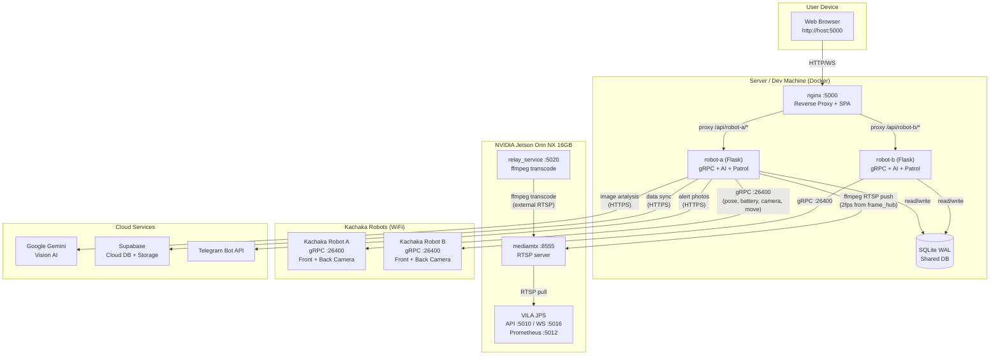
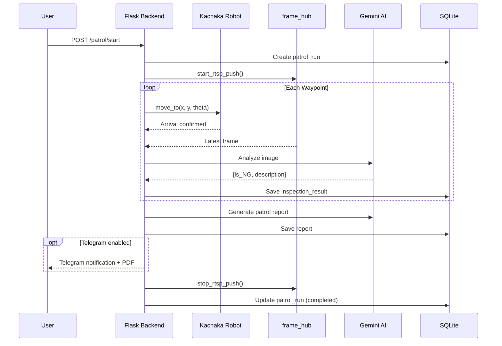
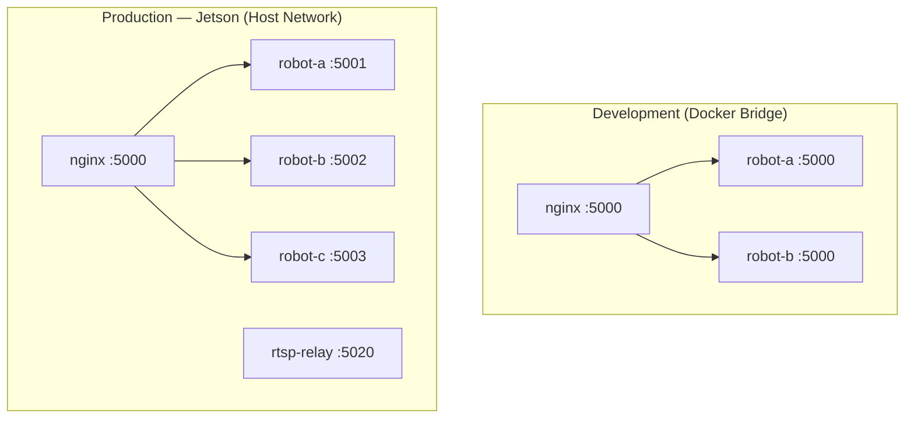

# Visual Patrol

> **Note:** This project uses `kachaka_api.KachakaApiClient` directly instead of the [`kachaka-sdk-toolkit`](https://github.com/sigmarobotics/kachaka-sdk-toolkit) (`kachaka_core`) best practices — no connection pooling, no `@with_retry`, no `CameraStreamer`, no `RobotController`. A migration to `kachaka_core` is planned.


[](LICENSE)

Autonomous multi-robot visual patrol system integrating **Kachaka Robot** with **Google Gemini Vision AI** and **NVIDIA VILA JPS** for intelligent environment monitoring and anomaly detection. A single web dashboard controls multiple robots through an nginx reverse proxy, with each robot running an isolated Flask backend sharing a common SQLite database.

The system supports three distinct AI analysis modes: per-waypoint cloud inspection via Gemini, full-patrol video analysis, and real-time edge inference via VILA JPS on Jetson hardware -- providing layered coverage from millisecond-latency alerts to deep analytical reports.

## Features

- **Multi-Robot Support** -- Single dashboard controls multiple robots via dropdown selector
- **Autonomous Patrol** -- Define waypoints per robot and navigate automatically
- **AI-Powered Inspection** -- Gemini Vision analyzes camera images at each waypoint (structured JSON output with OK/NG classification)
- **Edge AI Monitoring (VILA JPS)** -- Continuous camera monitoring via RTSP relay + VILA JPS with WebSocket alerts on Jetson hardware
- **Centralized Frame Hub** -- Single gRPC polling thread feeds an in-memory frame cache for all consumers (MJPEG, inspection, video, RTSP)
- **RTSP Camera Relay** -- Robot camera and external RTSP cameras relayed through Jetson relay service + mediamtx
- **Video Recording** -- Record patrol footage with codec auto-detection (H.264 / XVID / MJPEG)
- **Real-time Dashboard** -- Live map, robot position, battery, camera streams across 6 tabs
- **Scheduled Patrols** -- Recurring patrol times with day-of-week filtering
- **Multi-run Analysis Reports** -- AI-powered aggregated reports across date ranges
- **PDF Reports** -- Server-side PDF generation with Markdown and CJK (Traditional Chinese) support
- **Cloud Sync** -- Supabase integration for cross-device patrol data synchronization
- **Cloud Dashboard** -- Vercel-hosted web dashboard for remote monitoring (in `cloud-dashboard/`)
- **Telegram Notifications** -- Send patrol reports, PDFs, and edge AI alert photos
- **Manual Control** -- Web-based remote control with D-pad navigation
- **History & Token Analytics** -- Browse past patrols with token usage statistics and pricing estimates

## System Topology

The hardware deployment spans three physical machines (or two, in development):



## Software Architecture


## Patrol Flow



## Image Intelligence Pipeline


| # | Mode | Trigger | AI | Latency | Output |
|---|------|---------|----|---------|--------|
| 1 | Waypoint Inspection | Robot arrives at point | Gemini (Cloud) | ~3-5s | Structured JSON (OK/NG) |
| 2 | Video Analysis | Patrol completes | Gemini (Cloud) | ~5-30min | Narrative summary |
| 3 | Real-time Alert | Continuous | VILA JPS (Edge) | ~1-2s | WebSocket alert + photo |

## Quick Start

```bash
docker compose up -d
```

Open [http://localhost:5000](http://localhost:5000), go to **Settings** and configure:

1. **Google Gemini API Key** (Gemini AI tab)
2. **Timezone** (General tab)
3. **Live Monitor** (optional): Select stream source, set Jetson Host IP, define alert rules

Robot IPs are set per-service in `docker-compose.yml` via the `ROBOT_IP` environment variable.

### Adding a New Robot

Add a service to `docker-compose.yml`:

```yaml
  robot-d:
    container_name: visual_patrol_robot_d
    build: .
    volumes:
      - ./src:/app/src
      - ./data:/app/data
      - ./logs:/app/logs
    environment:
      - ROBOT_ID=robot-d
      - ROBOT_NAME=Robot D
      - ROBOT_IP=<robot-ip>:26400
    restart: unless-stopped
```

Add `robot-d` to nginx `depends_on`, then `docker compose up -d`.

For production (host networking), also add an `if` block in `deploy/nginx.conf` mapping the robot ID to its unique port.

## Tech Stack

| Layer | Technology |
|-------|-----------|
| Backend | Python 3.10, Flask 3.x |
| Frontend | Vanilla JS ES Modules (no framework), HTML SPA |
| Robot SDK | kachaka-api (gRPC, port 26400) |
| Cloud AI | Google Gemini (`google-genai` SDK) |
| Edge AI | NVIDIA VILA JPS (Jetson Orin NX) |
| Database | SQLite (WAL mode, shared across backends) |
| PDF | ReportLab with Noto Sans CJK TC fonts |
| Video | OpenCV (`opencv-python-headless`), ffmpeg |
| RTSP Server | mediamtx |
| Cloud Sync | Supabase (PostgreSQL + Storage) |
| Proxy | nginx |
| Container | Docker (multi-arch: amd64 + arm64) |
| CI/CD | GitHub Actions, GHCR |

## Project Structure

```
visual-patrol/
├── nginx.conf                  # Dev reverse proxy config
├── docker-compose.yml          # Dev: nginx + per-robot services (bridge network)
├── Dockerfile                  # Python 3.10-slim, non-root user, CJK fonts
├── entrypoint.sh               # Volume permission fix, drops to appuser
├── src/
│   ├── backend/
│   │   ├── app.py              # Flask REST API (~930 LOC, all routes)
│   │   ├── robot_service.py    # Kachaka gRPC interface, 100ms polling loop
│   │   ├── patrol_service.py   # Patrol orchestration, scheduling, async inspection
│   │   ├── cloud_ai_service.py # Gemini VLM provider, structured outputs, token tracking
│   │   ├── edge_ai_service.py  # VILA JPS live monitoring + test monitor
│   │   ├── jps_client.py       # VILA JPS HTTP/WebSocket API client
│   │   ├── frame_hub.py        # gRPC poll → frame cache → ffmpeg RTSP push
│   │   ├── relay_manager.py    # Jetson relay HTTP client
│   │   ├── sync_service.py     # Supabase cloud sync
│   │   ├── settings_service.py # DB-backed settings (module functions, not a class)
│   │   ├── pdf_service.py      # ReportLab PDF generation with CJK support
│   │   ├── database.py         # SQLite schema, migrations, multi-robot queries
│   │   ├── video_recorder.py   # OpenCV patrol video recording
│   │   ├── config.py           # Per-robot env config, DEFAULT_SETTINGS
│   │   ├── logger.py           # Timezone-aware logging with robot_id prefix
│   │   └── utils.py            # JSON I/O (atomic save), timezone utilities
│   └── frontend/
│       ├── templates/index.html  # SPA root (6 tabs, ~625 LOC)
│       └── static/
│           ├── css/style.css
│           └── js/
│               ├── app.js        # Entry point, tab switching, robot polling (5s)
│               ├── state.js      # Shared mutable state (single source of truth)
│               ├── map.js        # Canvas rendering, world-pixel transforms
│               ├── patrol.js     # Start/stop patrol, status polling (1s)
│               ├── points.js     # Patrol points CRUD, import/export
│               ├── controls.js   # Manual D-pad control
│               ├── ai.js         # AI test UI, JSON result display
│               ├── history.js    # Patrol history browser, PDF export
│               ├── reports.js    # Multi-run analysis reports
│               ├── schedule.js   # Scheduled patrol CRUD
│               ├── settings.js   # 3-tab settings UI (General, Gemini, VILA)
│               └── stats.js      # Token usage Chart.js bar chart
├── deploy/                       # Production configs (Jetson)
│   ├── docker-compose.prod.yaml  # Host networking, 3 robots + relay
│   ├── nginx.conf                # Production proxy (port-based routing)
│   ├── relay-service/            # Jetson ffmpeg relay Dockerfile + code
│   └── vila-jps/                 # VILA JPS deployment guide + patched streaming
├── cloud-dashboard/              # Supabase cloud dashboard (Vercel, vanilla JS)
└── .github/workflows/
    └── docker-publish.yaml       # CI: multi-arch Docker → GHCR (robot + relay images)
```

## Environment Variables

| Variable | Default | Description |
|----------|---------|-------------|
| `ROBOT_ID` | `default` | Unique robot identifier (must match Docker service name) |
| `ROBOT_NAME` | `Robot` | Human-readable robot name |
| `ROBOT_IP` | `192.168.50.133:26400` | Kachaka robot gRPC address |
| `PORT` | `5000` | Flask listening port |
| `DATA_DIR` | `<project>/data` | Shared data directory (SQLite DB, images) |
| `LOG_DIR` | `<project>/logs` | Log output directory |
| `TZ` | (system) | Container timezone |
| `RELAY_SERVICE_URL` | (empty) | Jetson relay service URL (e.g. `http://192.168.50.35:5020`) |
| `SUPABASE_URL` | (empty) | Supabase project URL (empty = sync disabled) |
| `SUPABASE_KEY` | (empty) | Supabase service_role key |
| `SITE_ID` | (empty) | Supabase sites table UUID |
| `CLOUD_DASHBOARD_URL` | (empty) | Cloud dashboard URL (e.g. Vercel deployment) |

## Database Schema

SQLite database at `data/report/report.db` with WAL mode and 5-second busy timeout.

| Table | Purpose |
|-------|---------|
| `patrol_runs` | Patrol sessions: timing, status, report content, per-category token counts |
| `inspection_results` | Per-waypoint AI results: coordinates, prompt, OK/NG, image path, tokens |
| `generated_reports` | Multi-run AI-generated aggregated reports |
| `robots` | Registered robots: ID, name, IP, last_seen, online/offline status |
| `global_settings` | Key-value settings store (JSON serialized values) |
| `edge_ai_alerts` | VILA JPS alert events: rule, evidence image, stream source |

Migrations are applied automatically on startup via `database.init_db()`. All migrations are idempotent (safe to run multiple times).

## URL Convention

- **Robot-specific**: `/api/{robot-id}/endpoint` -- nginx strips the robot ID prefix and routes to the correct backend
- **Global**: `/api/endpoint` -- proxied to `robot-a` (any backend works since they share the DB)

Global endpoints include: `/api/settings`, `/api/robots`, `/api/history`, `/api/stats`, `/api/reports`

Robot-specific endpoints include: `/api/{robot-id}/state`, `/api/{robot-id}/map`, `/api/{robot-id}/patrol/*`, `/api/{robot-id}/camera/*`, `/api/{robot-id}/points/*`

## Deployment



### Development

Uses Docker bridge networking. nginx resolves backend services by Docker DNS (`resolver 127.0.0.11`). All backends listen on the same internal port (5000).

```bash
docker compose up -d
# Open http://localhost:5000
```

### Production (Jetson)

Uses host networking (`network_mode: host`). Each Flask backend runs on a unique port (5001, 5002, ...). nginx routes via `if ($robot_id)` blocks to `127.0.0.1:PORT`.

```bash
# On Jetson: pull pre-built images from GHCR
cd /code/visual-patrol/deploy
docker compose -f docker-compose.prod.yaml pull
docker compose -f docker-compose.prod.yaml up -d
```

Docker images are built for **linux/amd64** and **linux/arm64** on every push to `main` via GitHub Actions.

- Robot image: `ghcr.io/sigmarobotics/visual-patrol:latest`
- Relay image: `ghcr.io/sigmarobotics/visual-patrol-relay:latest`

See [docs/deployment.md](docs/deployment.md) for full production setup instructions.

## Local Development (without Docker)

```bash
# Install dependencies
uv pip install --system -r src/backend/requirements.txt

# Set required environment variables
export DATA_DIR=$(pwd)/data LOG_DIR=$(pwd)/logs
export ROBOT_ID=robot-a ROBOT_NAME="Robot A"
export ROBOT_IP=<robot-ip>:26400

# Run the Flask backend
python src/backend/app.py
```

The backend serves both the API and the frontend (via Flask's static file serving) on port 5000.

## Settings

Settings are stored in the `global_settings` database table (not a config file). They are managed through the Settings tab in the web UI, which has three sub-tabs:

| Tab | Key Settings |
|-----|-------------|
| **General** | Timezone, idle camera stream toggle, Telegram bot token/user ID |
| **Gemini AI** | API key, model selection (`gemini-3-flash-preview` default), system prompt, report prompts, video analysis prompt, Telegram message prompt |
| **VILA** | Jetson host IP, stream source (robot camera / external RTSP), external RTSP URL, alert rules |

Legacy `settings.json` files are auto-migrated to the database on first boot.

## Documentation

| Document | Description |
|----------|-------------|
| [Architecture](docs/architecture.md) | System design, request flow, threading model |
| [Architecture (zh)](docs/zh/architecture.md) | System architecture (Traditional Chinese) |
| [API Reference](docs/api-reference.md) | All REST endpoints |
| [Frontend Guide](docs/frontend.md) | Module structure, state management |
| [Backend Guide](docs/backend.md) | Services, database schema |
| [Deployment](docs/deployment.md) | Dev and production setup |
| [Configuration](docs/configuration.md) | Environment variables, settings |
| [Jetson Debug](docs/jetson-debug-guide.md) | RTSP relay + VILA JPS debugging |

## License

Apache License 2.0 -- see [LICENSE](LICENSE).

Copyright 2026 Sigma Robotics
