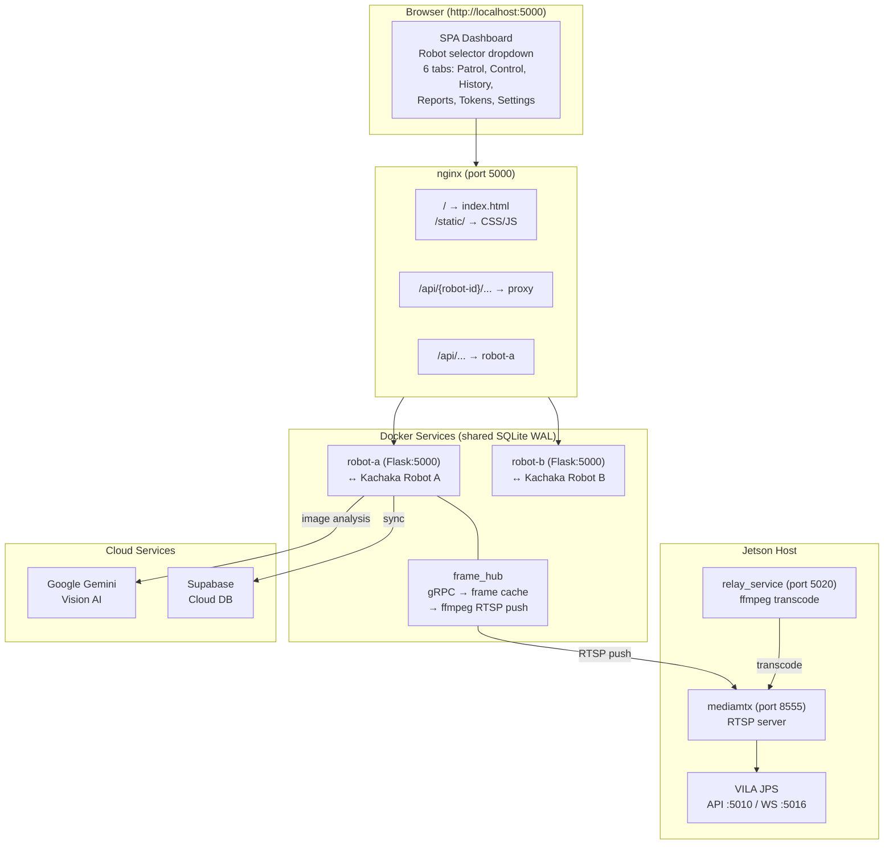
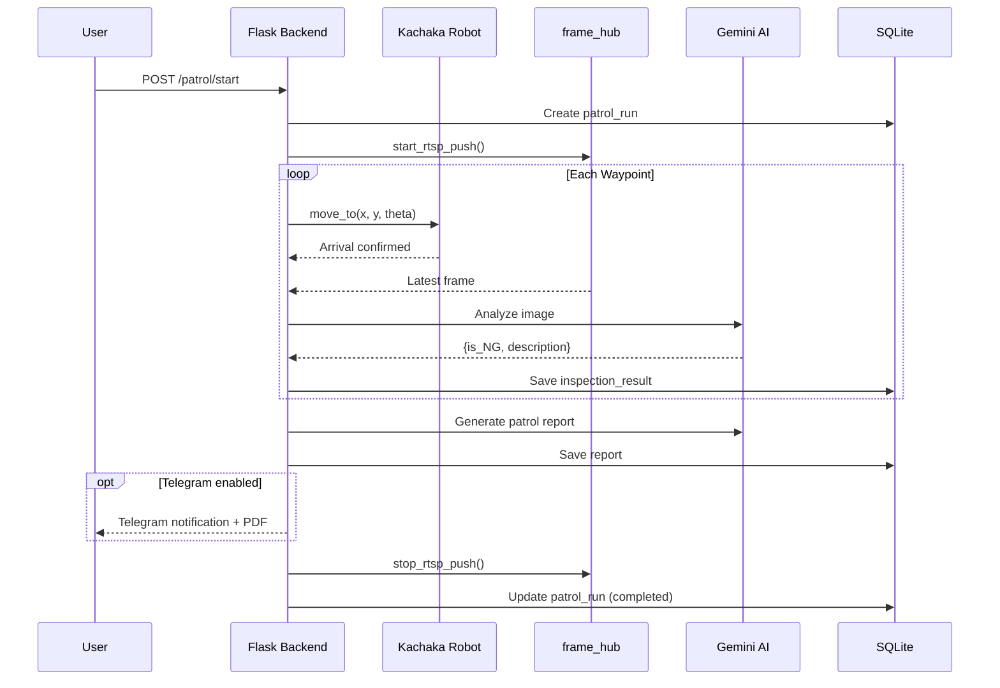
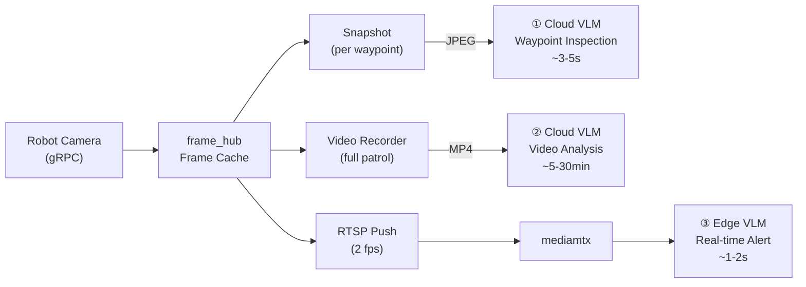
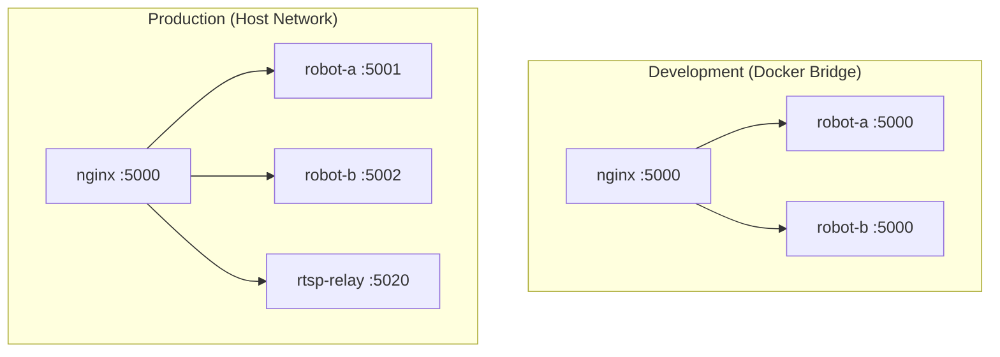

# Visual Patrol

> **Note:** This project uses `kachaka_api.KachakaApiClient` directly instead of the [`kachaka-sdk-toolkit`](https://github.com/sigmarobotics/kachaka-sdk-toolkit) (`kachaka_core`) best practices — no connection pooling, no `@with_retry`, no `CameraStreamer`, no `RobotController`. A migration to `kachaka_core` is planned.


Autonomous multi-robot visual patrol system integrating **Kachaka Robot** with **Google Gemini Vision AI** for intelligent environment monitoring and anomaly detection. A single web dashboard controls multiple robots through an nginx reverse proxy, with each robot running an isolated Flask backend sharing a common SQLite database.

## Features

- **Multi-Robot Support** — Single dashboard controls multiple robots via dropdown selector
- **Autonomous Patrol** — Define waypoints per robot and navigate automatically
- **AI-Powered Inspection** — Gemini Vision analyzes camera images at each waypoint (structured JSON output)
- **Live Monitoring (VILA JPS)** — Continuous camera monitoring via RTSP relay + VILA JPS with WebSocket alerts
- **Centralized Frame Hub** — Single gRPC polling thread feeds an in-memory frame cache for all consumers
- **RTSP Camera Relay** — Robot camera and external RTSP cameras relayed through Jetson relay service + mediamtx
- **Video Recording** — Record patrol footage with codec auto-detection (H.264 / XVID / MJPEG)
- **Real-time Dashboard** — Live map, robot position, battery, camera streams across 6 tabs
- **Scheduled Patrols** — Recurring patrol times with day-of-week filtering
- **Multi-run Analysis Reports** — AI-powered aggregated reports across date ranges
- **PDF Reports** — Server-side PDF generation with Markdown and CJK support
- **Cloud Sync** — Supabase integration for cross-device patrol data synchronization
- **Telegram Notifications** — Send patrol reports, PDFs, and live alert photos
- **Manual Control** — Web-based remote control with D-pad navigation
- **History & Token Analytics** — Browse past patrols with token usage statistics and pricing estimates

## Architecture



## Patrol Flow



## Image Intelligence Pipeline



| # | Mode | Trigger | AI | Latency | Output |
|---|------|---------|----|---------|--------|
| ① | Waypoint Inspection | Robot arrives at point | Gemini (Cloud) | ~3-5s | Structured JSON (OK/NG) |
| ② | Video Analysis | Patrol completes | Gemini (Cloud) | ~5-30min | Narrative summary |
| ③ | Real-time Alert | Continuous | VILA JPS (Edge) | ~1-2s | WebSocket alert + photo |

## Quick Start

```bash
docker compose up -d
```

Open [http://localhost:5000](http://localhost:5000), go to **Settings** and configure:

1. **Google Gemini API Key** (Gemini AI tab)
2. **Timezone** (General tab)
3. **Live Monitor** (optional): Select stream source, set Jetson Host IP, define alert rules

Robot IPs are set per-service in `docker-compose.yml` via the `ROBOT_IP` environment variable.

### Adding a New Robot

Add a service to `docker-compose.yml`:

```yaml
  robot-d:
    container_name: visual_patrol_robot_d
    build: .
    volumes:
      - ./src:/app/src
      - ./data:/app/data
      - ./logs:/app/logs
    environment:
      - ROBOT_ID=robot-d
      - ROBOT_NAME=Robot D
      - ROBOT_IP=<robot-ip>:26400
    restart: unless-stopped
```

Add `robot-d` to nginx `depends_on`, then `docker compose up -d`.

## Project Structure

```
visual-patrol/
├── nginx.conf                  # Dev reverse proxy
├── docker-compose.yml          # Dev: nginx + per-robot services
├── Dockerfile                  # Python 3.10, non-root
├── src/
│   ├── backend/
│   │   ├── app.py              # Flask REST API
│   │   ├── robot_service.py    # Kachaka gRPC interface
│   │   ├── patrol_service.py   # Patrol orchestration
│   │   ├── cloud_ai_service.py # Gemini AI integration
│   │   ├── edge_ai_service.py  # VILA JPS live monitoring
│   │   ├── frame_hub.py        # gRPC poll → frame cache → RTSP push
│   │   ├── relay_manager.py    # Jetson relay HTTP client
│   │   ├── sync_service.py     # Supabase cloud sync
│   │   ├── settings_service.py # DB-backed settings
│   │   ├── pdf_service.py      # PDF report generation
│   │   ├── database.py         # SQLite + migrations
│   │   ├── video_recorder.py   # Patrol video recording
│   │   ├── config.py           # Per-robot env config
│   │   ├── logger.py           # Timezone-aware logging
│   │   └── utils.py
│   └── frontend/
│       ├── templates/index.html  # SPA (no framework)
│       └── static/
│           ├── css/style.css
│           └── js/              # app, state, map, patrol, etc.
├── deploy/                     # Production configs
│   ├── docker-compose.prod.yaml
│   ├── nginx.conf
│   └── relay-service/          # Jetson ffmpeg relay
├── cloud-dashboard/            # Supabase cloud dashboard (Vercel)
└── .github/workflows/          # CI: multi-arch Docker → GHCR
```

## Deployment



```bash
# Production (host networking)
docker compose -f deploy/docker-compose.prod.yaml up -d
```

Docker images are built for **linux/amd64** and **linux/arm64** on every push to `main`.

See [docs/deployment.md](docs/deployment.md) for full production setup.

## Local Development

```bash
uv pip install --system -r src/backend/requirements.txt

export DATA_DIR=$(pwd)/data LOG_DIR=$(pwd)/logs
export ROBOT_ID=robot-a ROBOT_NAME="Robot A"
export ROBOT_IP=<robot-ip>:26400

python src/backend/app.py
```

## Documentation

| Document | Description |
|----------|-------------|
| [Architecture](docs/architecture.md) | System design, request flow, threading model |
| [架構文件](docs/zh/architecture.md) | 系統架構（中文） |
| [API Reference](docs/api-reference.md) | All REST endpoints |
| [Frontend Guide](docs/frontend.md) | Module structure, state management |
| [Backend Guide](docs/backend.md) | Services, database schema |
| [Deployment](docs/deployment.md) | Dev and production setup |
| [Configuration](docs/configuration.md) | Environment variables, settings |
| [Jetson Debug](docs/jetson-debug-guide.md) | RTSP relay + VILA JPS debugging |

## License

Apache License 2.0 — see [LICENSE](LICENSE).

Copyright 2026 Sigma Robotics
