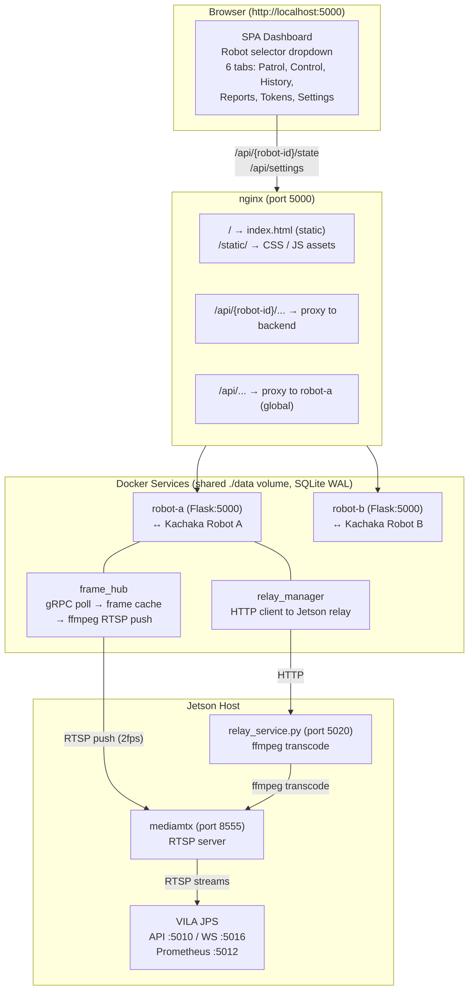
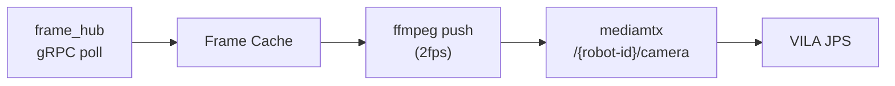
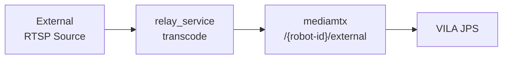
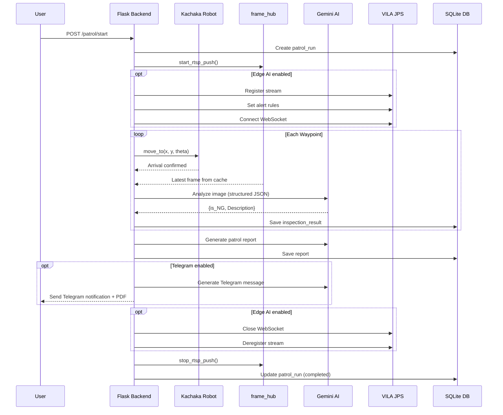
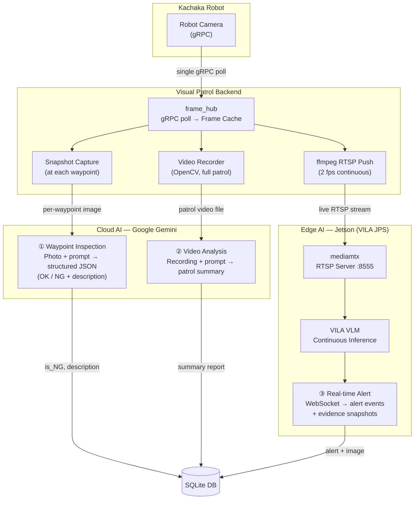
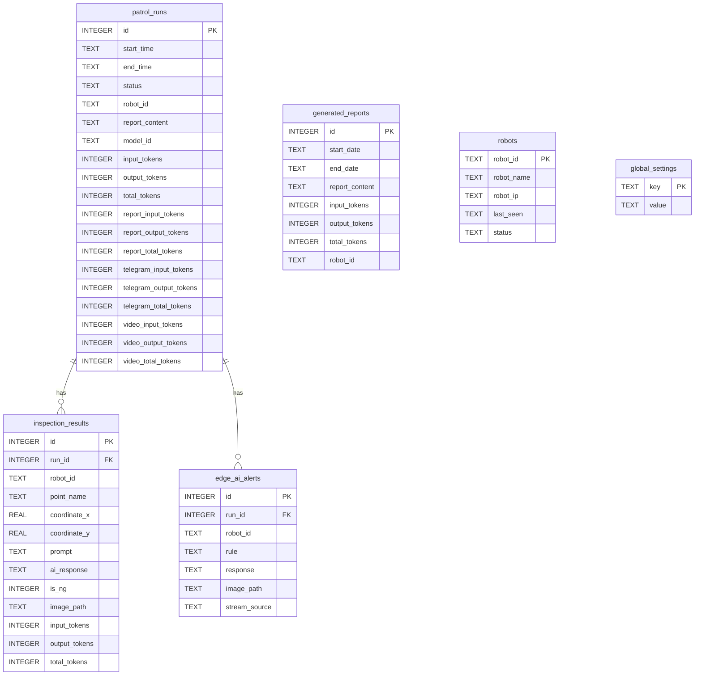
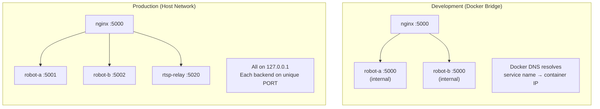

# Visual Patrol


Autonomous multi-robot patrol system integrating **Kachaka Robot** with **Google Gemini Vision AI** for intelligent environment monitoring and anomaly detection. A single web dashboard controls multiple robots through an nginx reverse proxy, with each robot running an isolated Flask backend sharing a common SQLite database.

## Features

- **Multi-Robot Support** -- Single dashboard controls multiple robots via dropdown selector
- **Autonomous Patrol** -- Define waypoints per robot and let them navigate automatically
- **AI-Powered Inspection** -- Gemini Vision analyzes camera images at each waypoint
- **Live Monitoring (VILA JPS)** -- Continuous camera monitoring via RTSP relay + VILA JPS Alert API with WebSocket-based alert events
- **Centralized Frame Hub** -- Single gRPC polling thread feeds an in-memory frame cache for all consumers (MJPEG, Gemini, video recorder, RTSP push)
- **RTSP Camera Relay** -- Robot camera (gRPC via frame_hub) and external RTSP cameras relayed through Jetson relay service + mediamtx
- **Video Recording** -- Record patrol footage with codec auto-detection (H.264 / XVID / MJPEG)
- **Real-time Dashboard** -- Live map, robot position, battery, camera streams across 6 tabs
- **Scheduled Patrols** -- Recurring patrol times with day-of-week filtering
- **Multi-run Analysis Reports** -- AI-powered aggregated reports across date ranges with dedicated Reports tab
- **PDF Reports** -- Server-side PDF generation with Markdown and CJK support
- **Telegram Notifications** -- Send patrol reports, PDFs, and live alert photos to Telegram
- **Manual Control** -- Web-based remote control with D-pad navigation
- **History & Token Analytics** -- Browse past patrols with token usage statistics, pricing estimates, and robot filtering

## Architecture



### Robot Camera Pipeline (direct push)



### External RTSP Pipeline (via relay)



### Patrol Flow



### Image Intelligence Pipeline

All image data originates from the robot's onboard camera. The centralized `frame_hub` polls the camera via gRPC once and distributes frames to three parallel AI processing paths — cloud-based semantic analysis and edge-based real-time alerting.



| # | Mode | Trigger | AI Target | Latency | Output |
|---|------|---------|-----------|---------|--------|
| ① | **Waypoint Inspection** | Robot arrives at patrol point | Cloud VLM (Gemini) | ~3-5 s per point | Structured JSON (OK/NG + description) |
| ② | **Video Analysis** | Patrol completes | Cloud VLM (Gemini) | ~10-30 s | Narrative summary of entire patrol |
| ③ | **Real-time Alert** | Continuous during patrol | Edge VLM (VILA on Jetson) | ~1-2 s | WebSocket alert event + evidence photo |

### Request Routing

- nginx regex `^/api/(robot-[^/]+)/(.*)$` strips the robot ID and proxies to the matching Docker service
- Docker service names **must** match robot IDs (`robot-a`, `robot-b`, etc.)
- Global endpoints (`/api/settings`, `/api/robots`, `/api/history`, `/api/stats`, `/api/reports`) proxy to any backend (shared DB)
- `frame_hub` manages the gRPC polling lifecycle and on-demand ffmpeg RTSP push to Jetson mediamtx
- The relay service on Jetson transcodes all streams to H264 Baseline for NvMMLite hardware decoder compatibility
- Adding a robot = add a service to `docker-compose.yml` + restart

## Quick Start

```bash
docker compose up -d
```

Open [http://localhost:5000](http://localhost:5000), go to **Settings** and configure:

1. **Google Gemini API Key** (Gemini AI tab)
2. **Timezone** (General tab)
3. **Live Monitor** (optional, VILA / Edge AI tab): Select stream source (robot camera or external RTSP), set Jetson Host IP, and define alert rules

Robot IPs are set per-service in `docker-compose.yml` via the `ROBOT_IP` environment variable.

### Adding a New Robot

Add a new service to `docker-compose.yml`:

```yaml
  robot-d:
    container_name: visual_patrol_robot_d
    build: .
    volumes:
      - ./src:/app/src
      - ./data:/app/data
      - ./logs:/app/logs
    environment:
      - DATA_DIR=/app/data
      - LOG_DIR=/app/logs
      - TZ=Asia/Taipei
      - ROBOT_ID=robot-d
      - ROBOT_NAME=Robot D
      - ROBOT_IP=192.168.50.135:26400
      - RELAY_SERVICE_URL=http://192.168.50.35:5020
    restart: unless-stopped
```

Add `robot-d` to the nginx `depends_on` list, then `docker compose up -d`.

## Project Structure

```
visual-patrol/
├── nginx.conf                  # Dev reverse proxy config
├── docker-compose.yml          # Dev: nginx + per-robot services (bridge network)
├── Dockerfile                  # Backend image (Python 3.10, non-root user)
├── .dockerignore
├── src/
│   ├── backend/
│   │   ├── app.py              # Flask REST API (~1000 lines)
│   │   ├── robot_service.py    # Kachaka gRPC interface
│   │   ├── patrol_service.py   # Patrol orchestration
│   │   ├── cloud_ai_service.py # Gemini AI integration
│   │   ├── edge_ai_service.py  # VILA JPS live monitoring + test monitor
│   │   ├── frame_hub.py        # Centralized gRPC poll -> frame cache -> RTSP push
│   │   ├── relay_manager.py    # HTTP client for Jetson relay service
│   │   ├── settings_service.py # Global settings (DB-backed)
│   │   ├── pdf_service.py      # PDF report generation
│   │   ├── database.py         # SQLite management + migrations
│   │   ├── config.py           # Per-robot env config + defaults
│   │   ├── video_recorder.py   # Video recording
│   │   ├── utils.py            # Utilities
│   │   ├── logger.py           # Timezone-aware logging
│   │   └── requirements.txt
│   └── frontend/
│       ├── templates/
│       │   └── index.html      # SPA (static, no Jinja2)
│       └── static/
│           ├── css/style.css
│           └── js/
│               ├── app.js      # Entry point, tab switching, robot selector
│               ├── state.js    # Shared state hub
│               ├── map.js      # Canvas map rendering
│               ├── controls.js # Manual D-pad control
│               ├── patrol.js   # Patrol start/stop, status polling
│               ├── points.js   # Waypoint CRUD
│               ├── schedule.js # Scheduled patrols
│               ├── ai.js       # AI test panel
│               ├── history.js  # Patrol history browser
│               ├── reports.js  # Multi-run report generation
│               ├── settings.js # Settings panel (3 sub-tabs)
│               └── stats.js    # Token usage chart (millions + pricing)
├── data/                       # Shared runtime data (SQLite DB, images)
├── logs/                       # Per-robot application logs
├── deploy/                     # Production config (host networking)
│   ├── docker-compose.prod.yaml
│   ├── nginx.conf
│   ├── relay-service/          # Jetson-side ffmpeg relay service
│   │   └── Dockerfile
│   └── vila-jps/               # VILA JPS patches
│       └── streaming_patched.py
└── .github/workflows/          # CI/CD (multi-arch build -> GHCR)
```

## Database Schema



## API Reference

### URL Convention

- **Robot-specific**: `/api/{robot-id}/endpoint` -- nginx strips the robot ID prefix before proxying
- **Global**: `/api/endpoint` -- proxied to any backend (shared DB)

### Robot Control (robot-specific)
| Endpoint | Method | Description |
|----------|--------|-------------|
| `/api/{id}/state` | GET | Robot status (battery, pose, map) |
| `/api/{id}/map` | GET | PNG map image |
| `/api/{id}/move` | POST | Move to coordinates `{x, y, theta}` |
| `/api/{id}/manual_control` | POST | D-pad control `{action}` |
| `/api/{id}/return_home` | POST | Return to charging station |
| `/api/{id}/cancel_command` | POST | Cancel current movement |
| `/api/{id}/camera/front` | GET | Front camera MJPEG stream (from frame_hub cache) |
| `/api/{id}/camera/back` | GET | Back camera MJPEG stream |

### Patrol Management (robot-specific)
| Endpoint | Method | Description |
|----------|--------|-------------|
| `/api/{id}/patrol/start` | POST | Start patrol |
| `/api/{id}/patrol/stop` | POST | Stop patrol |
| `/api/{id}/patrol/status` | GET | Current patrol status |
| `/api/{id}/patrol/schedule` | GET/POST | Manage scheduled patrols |
| `/api/{id}/patrol/schedule/{sid}` | PUT/DELETE | Update or delete schedule |
| `/api/{id}/patrol/results` | GET | Current run inspection results |
| `/api/{id}/patrol/edge_ai_alerts` | GET | Live monitor alerts for current run |

### Points (robot-specific)
| Endpoint | Method | Description |
|----------|--------|-------------|
| `/api/{id}/points` | GET/POST/DELETE | Manage patrol waypoints |
| `/api/{id}/points/reorder` | POST | Reorder waypoints |
| `/api/{id}/points/export` | GET | Export points as JSON |
| `/api/{id}/points/import` | POST | Import points from JSON file |
| `/api/{id}/points/from_robot` | GET | Import saved locations from robot |
| `/api/{id}/test_ai` | POST | Test AI on current camera frame |

### Edge AI Test (robot-specific)
| Endpoint | Method | Description |
|----------|--------|-------------|
| `/api/{id}/test_edge_ai/start` | POST | Start edge AI test (relay -> JPS -> WS) |
| `/api/{id}/test_edge_ai/stop` | POST | Stop edge AI test |
| `/api/{id}/test_edge_ai/status` | GET | Edge AI test status + alerts |

### Infrastructure (global)
| Endpoint | Method | Description |
|----------|--------|-------------|
| `/api/relay/status` | GET | RTSP relay process statuses |
| `/api/relay/test` | POST | Quick-test robot camera relay |
| `/api/edge_ai/health` | GET | VILA JPS health check |

### Global Endpoints
| Endpoint | Method | Description |
|----------|--------|-------------|
| `/api/settings` | GET/POST | System settings (sensitive fields masked in GET) |
| `/api/robots` | GET | All registered robots with online status |
| `/api/history` | GET | Patrol history (`?robot_id=` filter) |
| `/api/history/{run_id}` | GET | Patrol run detail with inspections |
| `/api/report/{run_id}/pdf` | GET | Download single patrol PDF |
| `/api/reports` | GET | List generated multi-run reports |
| `/api/reports/generate` | POST | Generate multi-run analysis report |
| `/api/reports/generate/pdf` | GET | Download multi-run analysis PDF |
| `/api/stats/token_usage` | GET | Token usage by date (`?robot_id=` filter) |

## Configuration

Settings are stored in a shared SQLite database (`data/report/report.db`, table `global_settings`) and managed through the web UI Settings page, which has three sub-tabs: **General**, **Gemini AI**, and **VILA / Edge AI**.

### General Tab
| Setting | Description |
|---------|-------------|
| `timezone` | Display timezone (e.g. `Asia/Taipei`) |
| `turbo_mode` | Async AI analysis (robot moves while images process) |
| `enable_idle_stream` | Camera stream when not patrolling |
| `enable_telegram` | Telegram notifications on patrol completion |
| `telegram_bot_token` / `telegram_user_id` | Telegram config |

### Gemini AI Tab
| Setting | Description |
|---------|-------------|
| `gemini_api_key` | Google Gemini API key |
| `gemini_model` | AI model name (e.g. `gemini-3-flash-preview`) |
| `system_prompt` | AI system role prompt |
| `report_prompt` | Single patrol report generation prompt |
| `telegram_message_prompt` | Prompt for Telegram notification messages |
| `multiday_report_prompt` | Multi-day aggregated report prompt |
| `enable_video_recording` | Record patrol video |
| `video_prompt` | Video analysis prompt |

### VILA / Edge AI Tab
| Setting | Description |
|---------|-------------|
| `enable_edge_ai` | Enable VILA JPS live monitoring during patrol |
| Stream source (radio) | Robot Camera Relay OR External RTSP (max 1 stream, mutually exclusive) |
| `jetson_host` | Jetson device IP (auto-derives JPS port 5010, mediamtx port 8555, relay port 5020, WS port 5016) |
| `external_rtsp_url` | External RTSP camera source URL |
| `edge_ai_rules` | List of yes/no alert rules for live monitoring (max 10) |

### Environment Variables (per-robot, in docker-compose.yml)
| Variable | Description |
|----------|-------------|
| `ROBOT_ID` | Robot identifier (must match Docker service name) |
| `ROBOT_NAME` | Display name |
| `ROBOT_IP` | Kachaka robot IP:port |
| `PORT` | Flask listening port (default 5000; set per-robot in production) |
| `RELAY_SERVICE_URL` | Jetson relay service URL (e.g. `http://192.168.50.35:5020`); empty = relay unavailable |
| `DATA_DIR` | Shared data directory |
| `LOG_DIR` | Log output directory |

### Derived Constants (config.py)
| Constant | Value | Description |
|----------|-------|-------------|
| `JETSON_JPS_API_PORT` | 5010 | VILA JPS API port |
| `JETSON_JPS_METRICS_PORT` | 5012 | VILA JPS Prometheus metrics port |
| `JETSON_MEDIAMTX_PORT` | 8555 | mediamtx RTSP port |

## Deployment

### Networking Modes



Docker images are automatically built for **linux/amd64** and **linux/arm64** on every push to `main`.

```bash
# Production (host networking, for Jetson / Linux)
docker compose -f deploy/docker-compose.prod.yaml up -d
```

See [docs/deployment.md](docs/deployment.md) for production setup including multi-robot configuration and mediamtx port configuration.

## Local Development

```bash
uv pip install --system -r src/backend/requirements.txt

export DATA_DIR=$(pwd)/data
export LOG_DIR=$(pwd)/logs
export ROBOT_ID=robot-a
export ROBOT_NAME="Robot A"
export ROBOT_IP=192.168.50.133:26400

python src/backend/app.py
```

## Troubleshooting

| Problem | Solution |
|---------|----------|
| Robot shows "offline" | Check `ROBOT_IP` in docker-compose.yml; ensure robot is on same network |
| Robot dropdown empty | Verify backends are running: `docker compose ps` |
| AI analysis failed | Verify Gemini API key in Settings > Gemini AI; check `logs/{robot-id}_cloud_ai_service.log` |
| PDF generation failed | Check `logs/{robot-id}_app.log` |
| Camera stream not loading | Enable "Continuous Camera Stream" in Settings > General; check robot connection |
| Map not loading | Robot may still be connecting; check container logs for gRPC errors |
| Relay service not reachable | Ensure `RELAY_SERVICE_URL` is set in docker-compose.yml; verify relay service is running on Jetson |
| Live monitor not starting | Verify `jetson_host` is set in Settings > VILA / Edge AI; check that relay service + mediamtx + VILA JPS are running on Jetson |
| Live monitor no alerts | Check `/api/relay/status` for stream status; verify alert rules are configured; check `logs/{robot-id}_edge_ai_service.log` |
| RTSP push to mediamtx fails | Check `logs/{robot-id}_frame_hub.log`; ensure mediamtx is running on Jetson at port 8555 |
| Edge AI test fails | Ensure stream source is selected (radio button); check Jetson Host IP and that relay service is accessible |

## Documentation

Detailed documentation is available in the [`docs/`](docs/) directory:

- [Architecture Overview](docs/architecture.md) -- System design, request flow, threading model, networking
- [API Reference](docs/api-reference.md) -- All REST endpoints with request/response examples
- [Frontend Guide](docs/frontend.md) -- Module structure, state management, UI patterns
- [Backend Guide](docs/backend.md) -- Services, database schema, startup sequence
- [Deployment Guide](docs/deployment.md) -- Dev and production setup, Docker, adding robots
- [Configuration](docs/configuration.md) -- Environment variables, settings, per-robot config files
- [Jetson Debug Guide](docs/jetson-debug-guide.md) -- RTSP relay + VILA JPS debugging on Jetson

## License

This project is licensed under the Apache License 2.0 - see the [LICENSE](LICENSE) file for details.

Copyright 2026 Sigma Robotics
