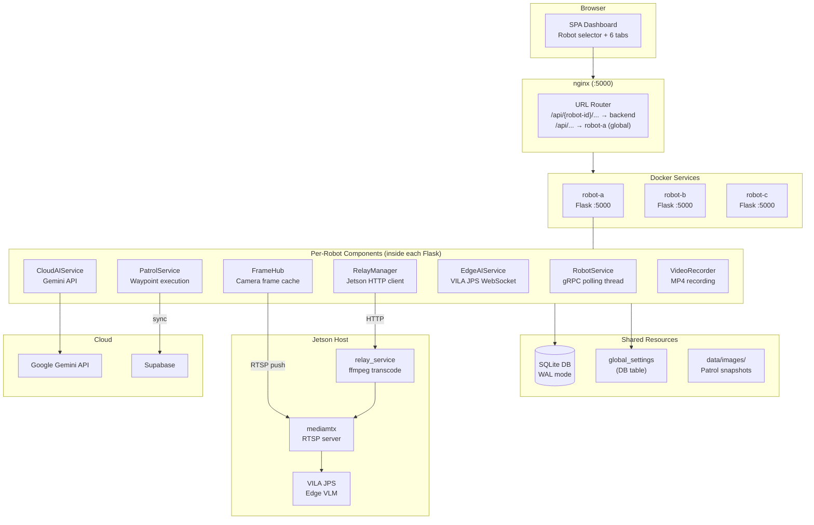
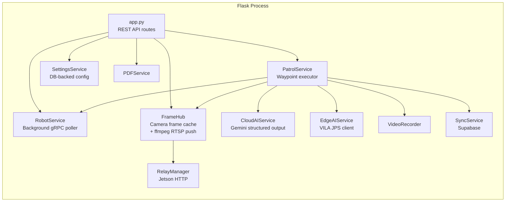
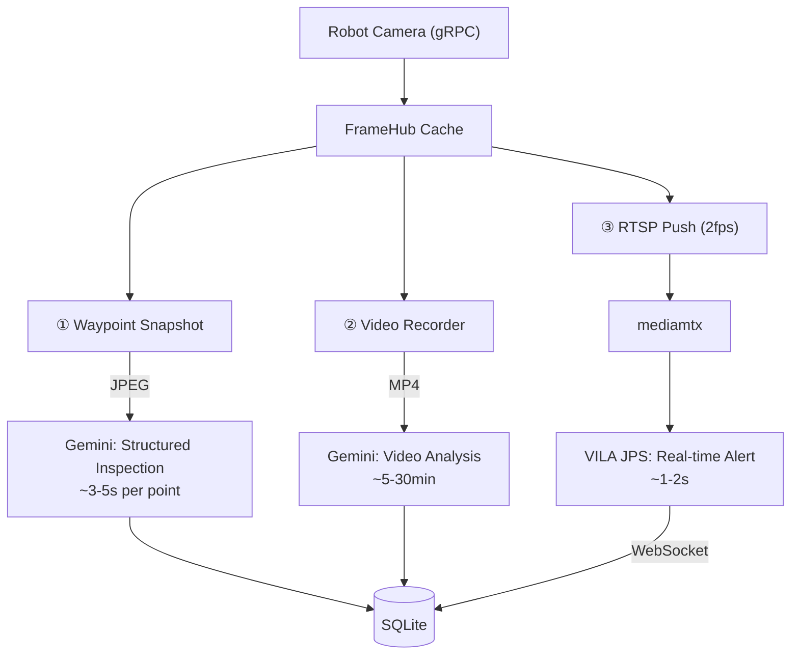
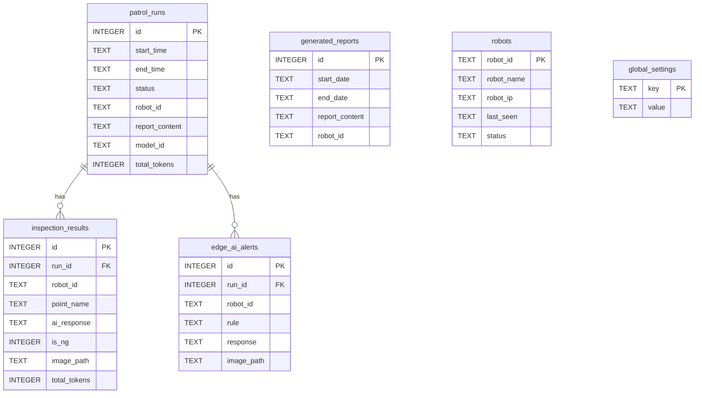
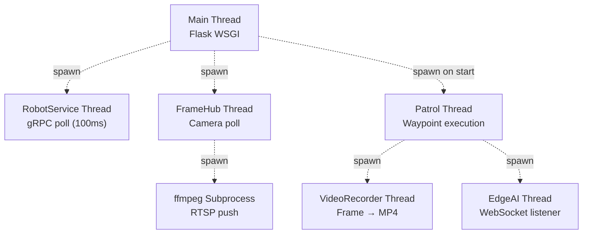
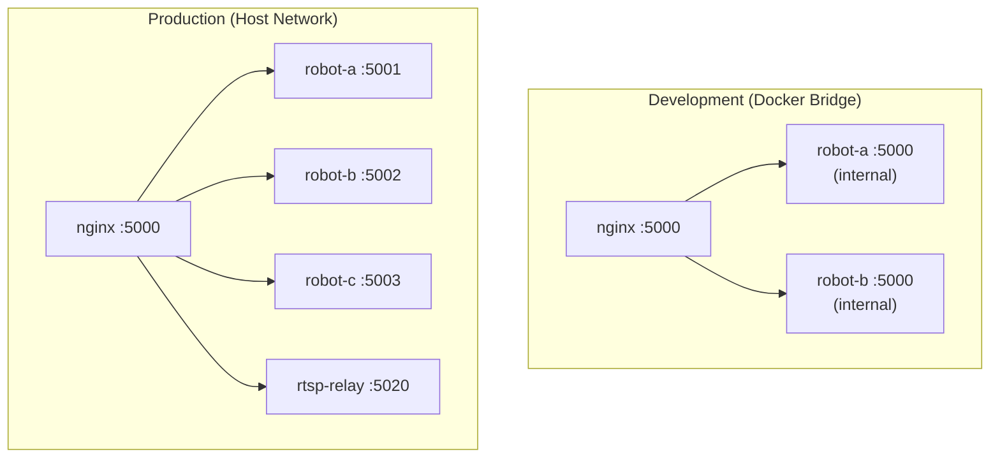

# Visual Patrol — Architecture

## Overview

Visual Patrol is a multi-robot autonomous patrol system that combines **Kachaka mobile robots** with **Google Gemini Vision AI** and optional **VILA JPS edge AI** for environment monitoring and anomaly detection.

The system follows a **per-robot backend** architecture: each robot runs its own Flask process, sharing a common SQLite database via WAL mode. An nginx reverse proxy multiplexes all robots behind a single port, routing requests by robot ID extracted from the URL path.

## System Architecture



## Request Routing

nginx uses a regex pattern to extract the robot ID from the URL and proxy to the matching Docker service:

```
^/api/(robot-[^/]+)/(.*)$  →  http://$robot_svc:5000/api/$api_path
```

- Docker service names **must** match robot IDs (`robot-a`, `robot-b`, etc.)
- Global endpoints (`/api/settings`, `/api/robots`, `/api/history`) proxy to `robot-a` since all backends share the same database
- Adding a robot = add a Docker service + restart

## Per-Robot Backend Components

Each Flask backend instantiates these services at startup:



### RobotService

- Background thread polls Kachaka robot via gRPC every 100ms
- Maintains cached state: battery, pose, map image, map metadata
- Provides blocking command methods: `move_to()`, `return_home()`, `cancel_command()`
- Auto-reconnects on gRPC failure with 2s backoff
- **Uses `kachaka_api.KachakaApiClient` directly** (not `kachaka_core`)

### FrameHub

- Single gRPC polling thread captures camera frames into an in-memory cache
- Serves MJPEG streams for the web UI (`/api/{id}/camera/front`)
- On-demand ffmpeg subprocess pushes RTSP stream to Jetson mediamtx (2 fps)
- Thread-safe frame access via lock
- All consumers (MJPEG, Gemini snapshot, video recorder, RTSP push) read from the same cache

### PatrolService

- Executes patrol as a background thread
- For each waypoint: move robot → capture frame → Gemini analysis → save result
- Supports turbo mode (async AI analysis — robot moves while images process)
- Manages edge AI lifecycle (register/deregister streams, WebSocket connection)
- Handles video recording start/stop around patrol

### CloudAIService

- Wraps Google Gemini API for structured image analysis
- Returns `{is_ng: bool, description: str}` per waypoint
- Generates patrol reports, Telegram messages, multi-day aggregated reports
- Handles video analysis (upload MP4 → Gemini Files API → analyze)
- Token usage tracking per call

### EdgeAIService

- Manages VILA JPS integration for real-time monitoring during patrol
- Registers/deregisters RTSP streams with JPS API
- Connects WebSocket for alert events
- Stores alerts in `edge_ai_alerts` table
- Also provides standalone test mode via `/api/{id}/test_edge_ai/*`

## Image Intelligence Pipeline

Three parallel AI processing paths from a single camera source:



| # | Mode | Trigger | AI | Latency | Output |
|---|------|---------|----|---------|--------|
| ① | Waypoint Inspection | Robot arrives at point | Gemini (Cloud) | ~3-5s | Structured JSON (OK/NG) |
| ② | Video Analysis | Patrol completes | Gemini (Cloud) | ~5-30min | Narrative summary |
| ③ | Real-time Alert | Continuous | VILA JPS (Edge) | ~1-2s | WebSocket alert + photo |

## Database Schema



## Threading Model



All threads are daemon threads — they auto-exit when the Flask process stops.

## Networking Modes



- **Development**: Docker bridge network, DNS resolves service names, all backends on port 5000
- **Production**: Host networking, each backend on a unique `PORT` env var, direct localhost access

## Configuration

Settings are stored in SQLite (`global_settings` table) and managed via the web UI:

| Category | Settings |
|----------|----------|
| General | timezone, turbo_mode, idle_stream, telegram config |
| Gemini AI | API key, model, system prompt, report prompts, video prompt |
| VILA / Edge AI | enable, stream source, jetson_host, RTSP URL, alert rules |

Per-robot config is set via environment variables in `docker-compose.yml`:

| Variable | Purpose |
|----------|---------|
| `ROBOT_ID` | Robot identifier (must match Docker service name) |
| `ROBOT_NAME` | Display name |
| `ROBOT_IP` | Kachaka robot IP:port |
| `PORT` | Flask port (default 5000, unique per robot in production) |
| `RELAY_SERVICE_URL` | Jetson relay service URL |

## Cloud Sync (Supabase)

Optional integration syncs patrol data to Supabase for cross-device access:

- Patrol runs, inspection results, and robot status synced after each patrol
- Cloud dashboard deployed on Vercel (`cloud-dashboard/`)
- Configured via `SUPABASE_URL` and `SUPABASE_KEY` environment variables

## CI/CD

GitHub Actions builds multi-arch Docker images on every push to `main`:

- Platforms: `linux/amd64`, `linux/arm64`
- Registry: `ghcr.io/sigmarobotics/visual-patrol`
- Separate workflow for relay service image
