# System Architecture

## 1. System Overview

Visual Patrol is a multi-robot autonomous inspection system. A web-based SPA connects through an nginx reverse proxy to per-robot Flask backend instances, all sharing a common SQLite database (WAL mode). Each backend communicates with its assigned Kachaka robot via gRPC and can leverage both cloud AI (Google Gemini) and edge AI (VILA JPS on Jetson) for visual analysis.

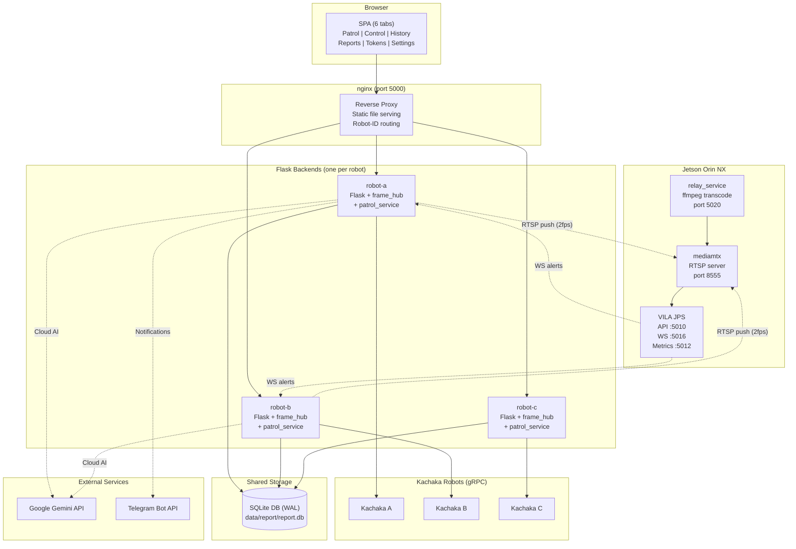

## 2. Image Inspection Architecture

### 2a. Cloud AI (Gemini)

Each patrol point inspection follows a synchronous (or turbo-mode async) pipeline: capture a frame from the gRPC cache, send it to the Gemini API with a structured output schema, parse the `is_NG`/`Description` response, and store the result in the database.

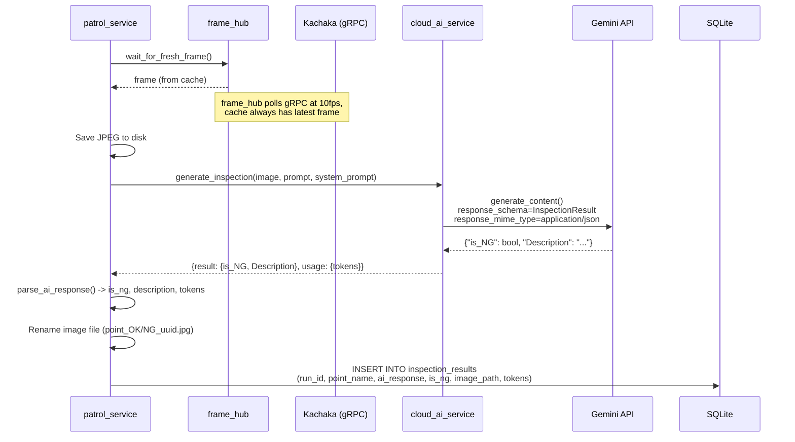

**Turbo mode**: When enabled, `_inspect_point` enqueues tasks to `inspection_queue` instead of blocking. The `_inspection_worker` background thread processes them asynchronously, allowing the robot to move to the next point immediately. The queue is drained before the patrol finishes via `inspection_queue.join()`.

### 2b. Edge AI (VILA JPS on Jetson)

Edge AI uses VILA JPS running on a Jetson Orin NX for continuous, real-time VLM monitoring of RTSP streams. The system registers streams, sets alert rules, and listens for WebSocket events.

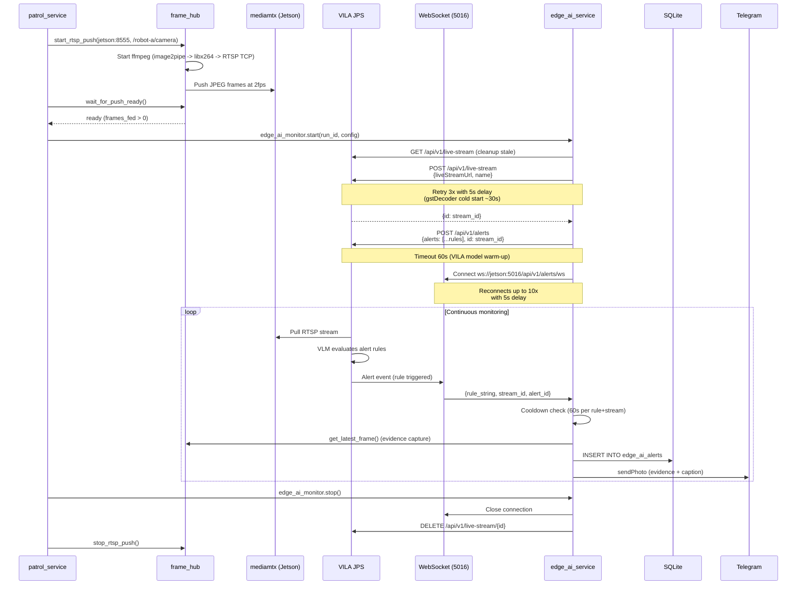

## 3. Robot Disconnection Handling

The system operates over mesh Wi-Fi networks where brief gRPC disconnections are expected. `robot_service.py` is designed for resilience with automatic reconnection at every layer.

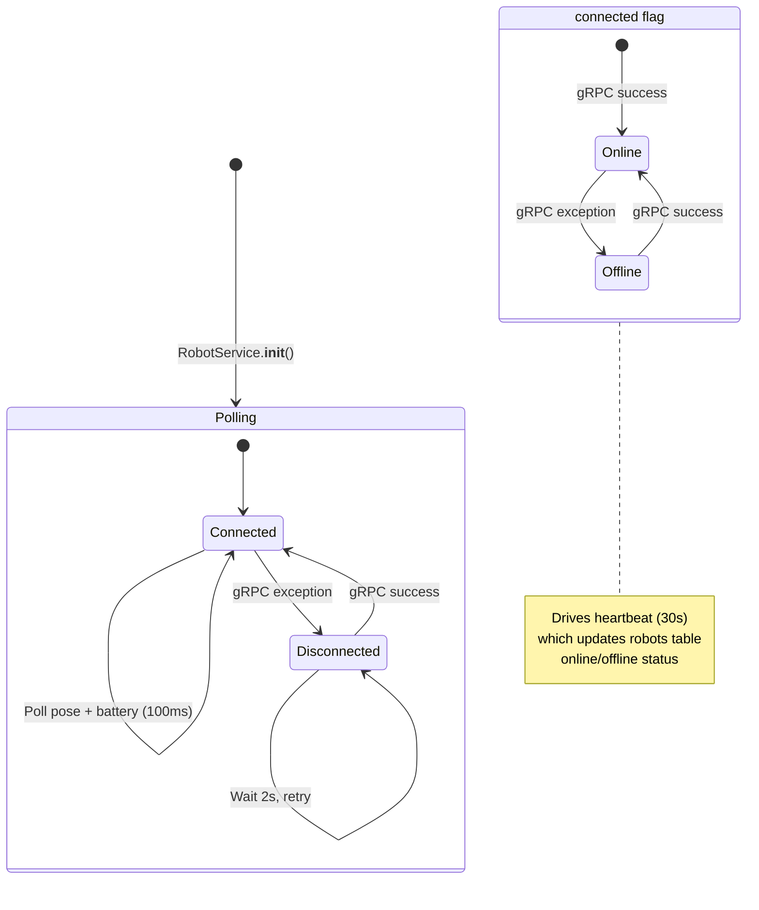

### 3-Phase Move Command

`move_to()` and `return_home()` use a 3-phase pattern to handle transient gRPC failures without accidentally re-sending movement commands.

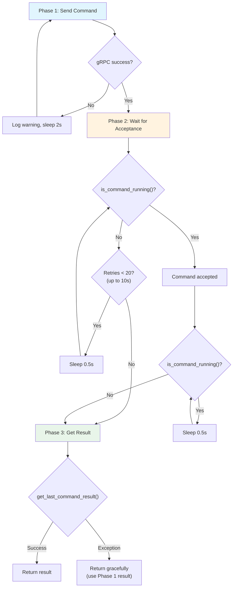

**Key design decisions:**
- Phase 1 retries indefinitely (mesh may be down for minutes)
- Phase 2 waits for Kachaka to acknowledge the command before polling completion (prevents reading stale state from the previous command)
- Phase 3 fails gracefully -- the robot has already moved, so losing the result is acceptable
- `return_home()` uses the identical 3-phase pattern

## 4. Frame Hub Architecture

The frame hub (`frame_hub.py`) centralizes all camera access through a single gRPC polling thread and shared frame cache. This eliminates redundant gRPC calls that previously caused contention.

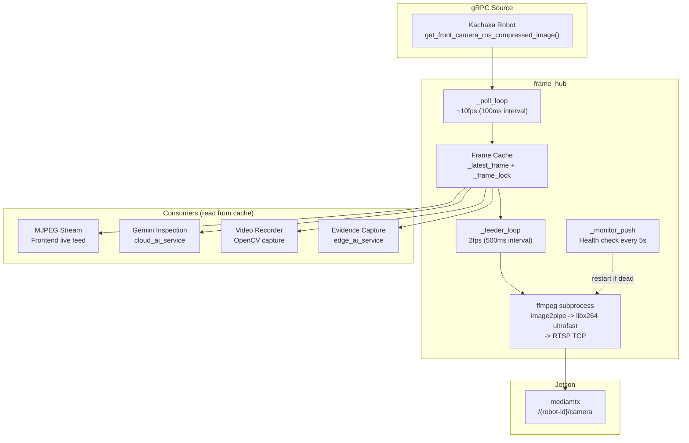

**Polling lifecycle** -- determined by `_evaluate()`:

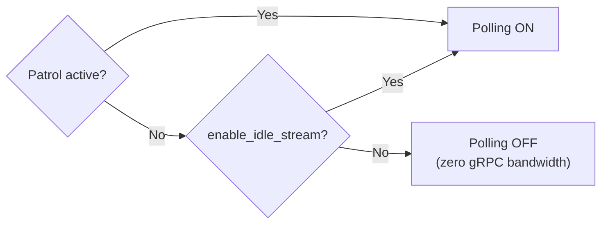

**ffmpeg push command:**
```
ffmpeg -y -f image2pipe -framerate 2 -i pipe:0
  -vf scale=1280:720:force_original_aspect_ratio=decrease,pad=1280:720:(ow-iw)/2:(oh-ih)/2
  -c:v libx264 -preset ultrafast -tune zerolatency -profile:v baseline -level 3.1
  -pix_fmt yuv420p -x264-params keyint=1:min-keyint=1:repeat-headers=1
  -bsf:v dump_extra -f rtsp -rtsp_transport tcp rtsp://{host}:{port}/{path}
```

## 5. RTSP Relay Layer

Two distinct pipelines feed RTSP streams to mediamtx for VILA JPS consumption.

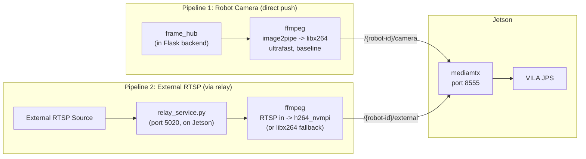

| Property | Robot Camera (direct push) | External RTSP (via relay) |
|----------|---------------------------|---------------------------|
| Source | gRPC frame cache (JPEG) | RTSP URL |
| Encoder | libx264 (CPU, ultrafast) | h264_nvmpi (NVENC) or libx264 fallback |
| Frame rate | 2fps (from feeder loop) | Source native |
| Profile | H.264 Baseline | H.264 Baseline |
| mediamtx path | `/{robot-id}/camera` | `/{robot-id}/external` |
| Managed by | frame_hub (in Flask) | relay_service (on Jetson) |
| Evidence capture | gRPC `get_latest_frame()` | OpenCV RTSP from mediamtx |

## 6. Request Flow

### Robot-Specific vs Global Requests

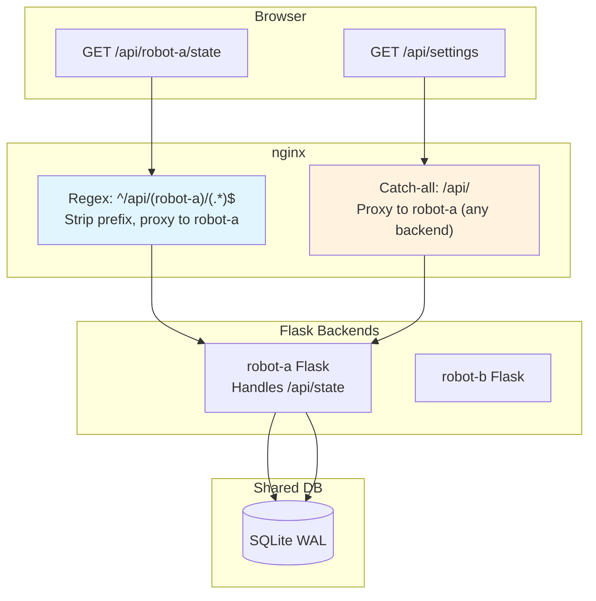

**URL convention:**
- **Robot-specific**: `fetch(/api/${state.selectedRobotId}/endpoint)` -- nginx strips robot-id prefix, routes to the matching backend
- **Global**: `fetch('/api/endpoint')` -- proxied to robot-a (any backend works, shared DB)

**Global endpoints**: `/api/settings`, `/api/robots`, `/api/history`, `/api/stats`, `/api/reports`

**Robot-specific endpoints**: `/api/state`, `/api/map`, `/api/move`, `/api/patrol/*`, `/api/points/*`, `/api/camera/*`, `/api/test_ai`, `/api/images/*`

## 7. Database Schema

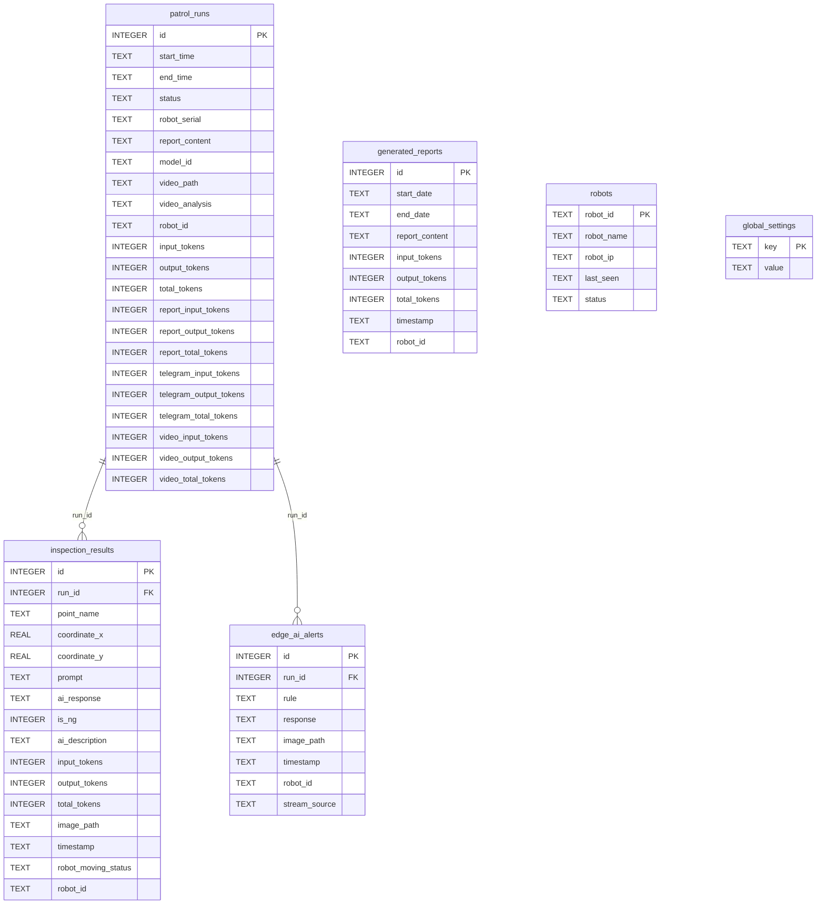

**Connection settings:** WAL mode, 5000ms busy timeout. All backends share one DB file at `data/report/report.db`. The `robot_id` column on `patrol_runs`, `inspection_results`, `generated_reports`, and `edge_ai_alerts` distinguishes data per robot.

## 8. Threading Model

Each Flask backend runs several background daemon threads.

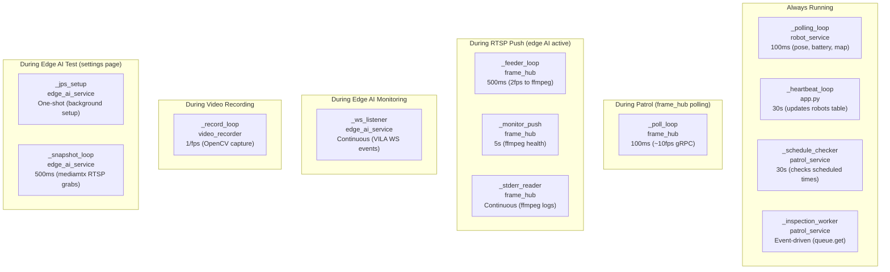

| Thread | Module | Interval | Lifecycle |
|--------|--------|----------|-----------|
| `_polling_loop` | robot_service | 100ms | Always (from init) |
| `_heartbeat_loop` | app.py | 30s | Always (from startup) |
| `_schedule_checker` | patrol_service | 30s | Always (from init) |
| `_inspection_worker` | patrol_service | Event-driven | Always (from init) |
| `_poll_loop` | frame_hub | 100ms | Patrol active OR idle stream enabled |
| `_feeder_loop` | frame_hub | 500ms | RTSP push active |
| `_monitor_push` | frame_hub | 5s | RTSP push active |
| `_stderr_reader` | frame_hub | Continuous | RTSP push active |
| `_ws_listener` | edge_ai_service | Continuous | Edge AI monitoring active |
| `_record_loop` | video_recorder | 1/fps | Video recording active |
| `_jps_setup` | edge_ai_service | One-shot | Edge AI test only |
| `_snapshot_loop` | edge_ai_service | 500ms | Edge AI test only |

## 9. Networking Modes

### Development (WSL2 / Docker Desktop)

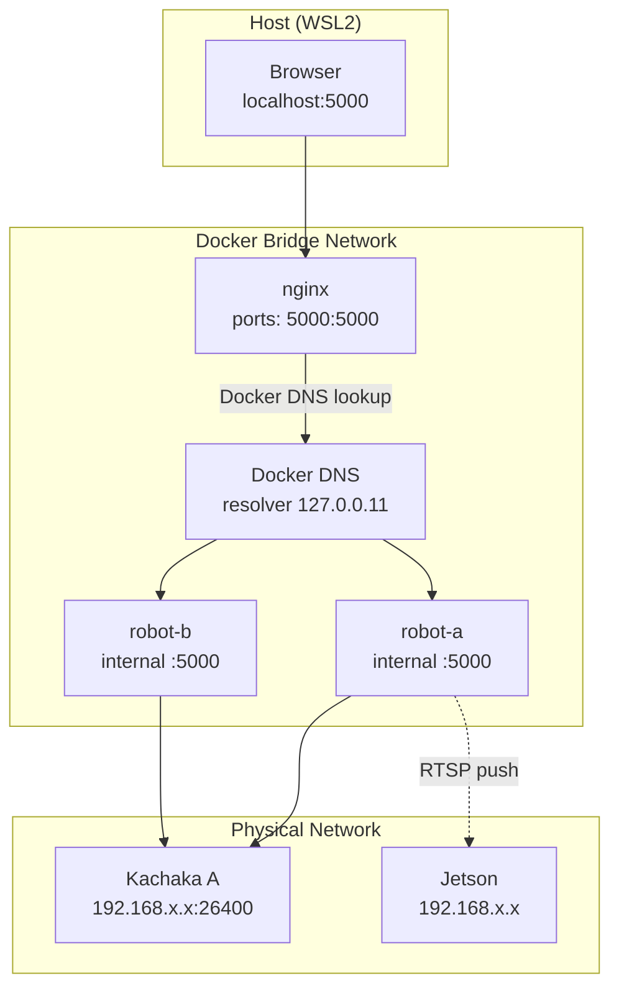

- Docker service names must match `ROBOT_ID` values (e.g., service `robot-a` = `ROBOT_ID=robot-a`)
- nginx resolves backends via Docker DNS (`resolver 127.0.0.11`)
- All Flask backends listen on internal port 5000
- `RELAY_SERVICE_URL` points to Jetson relay service (e.g., `http://192.168.50.35:5020`)

### Production (Jetson / Linux host)

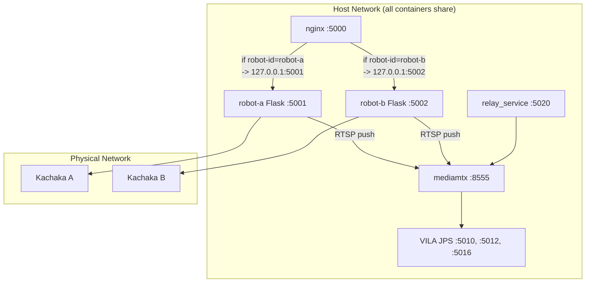

- All containers use `network_mode: host` (required: Jetson has `iptables: false`)
- Each Flask backend uses a unique `PORT` env var (5001, 5002, ...)
- nginx routes by robot ID using explicit `if ($robot_id = "robot-a")` rules to `127.0.0.1:PORT`
- `jetson_host` setting auto-derives all Jetson service URLs
- Adding a robot = add docker-compose service + add nginx `if` block

## 10. Patrol Lifecycle

Full flow from start to finish, including edge AI setup and teardown.

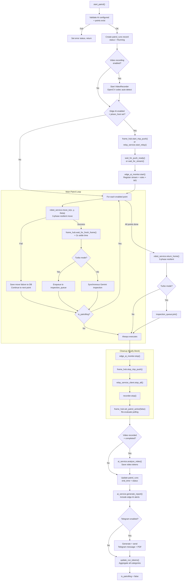

## 11. Data Model (Filesystem Layout)

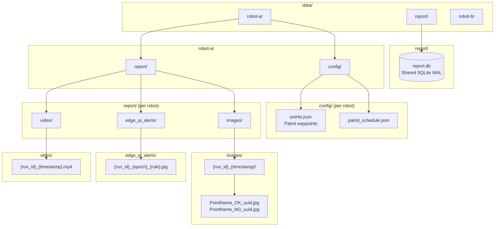

**Filesystem conventions:**
- Shared DB at `data/report/report.db` -- all backends read/write via WAL
- Per-robot data under `data/{robot_id}/` -- config files and inspection artifacts
- Inspection images organized by run: `data/{robot_id}/report/images/{run_id}_{timestamp}/`
- Image filenames encode inspection result: `{PointName}_{OK|NG}_{uuid}.jpg`
- Edge AI evidence images: `data/{robot_id}/report/edge_ai_alerts/{run_id}_{epoch}_{rule}.jpg`
- Video recordings: `data/{robot_id}/report/video/{run_id}_{timestamp}.mp4`
