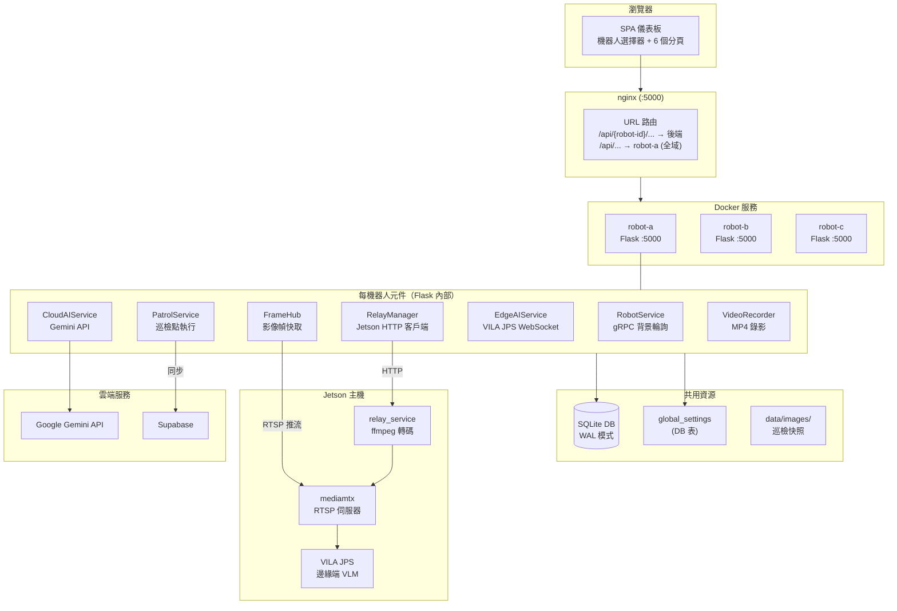
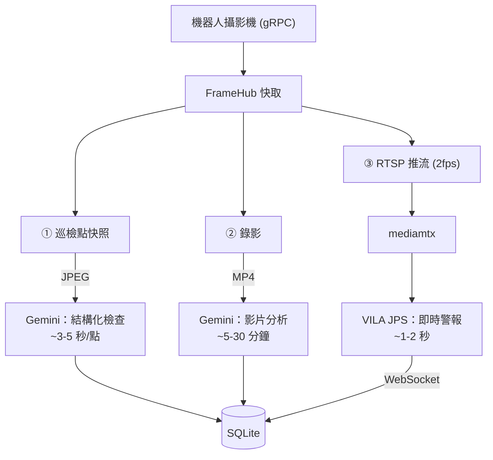
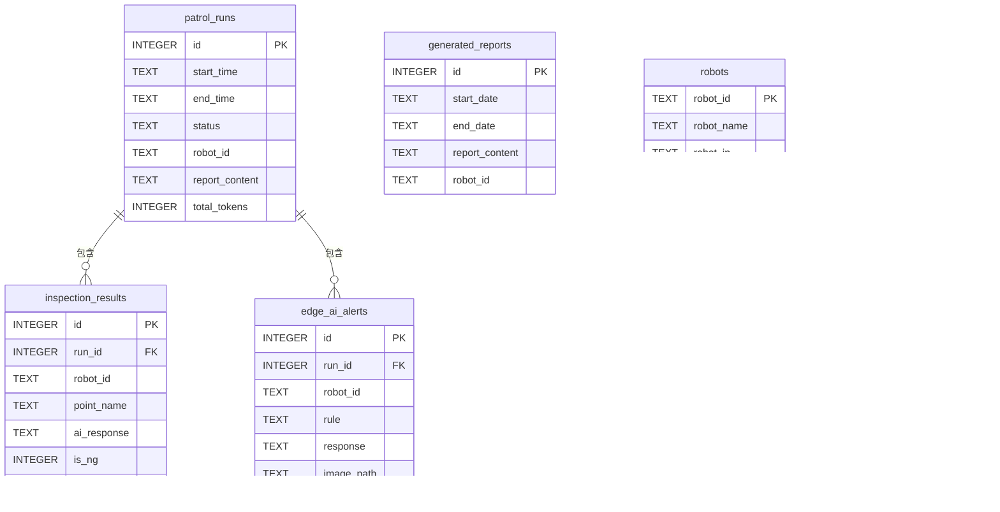
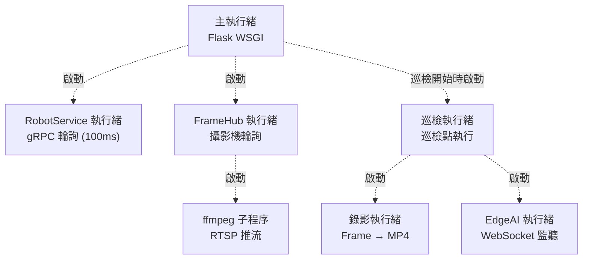

# Visual Patrol — 系統架構

## 概述

Visual Patrol 是一套多機器人自主巡檢系統，結合 **Kachaka 移動機器人**、**Google Gemini Vision AI**（雲端）與 **VILA JPS**（邊緣端）進行環境監控與異常偵測。

系統採用 **每機器人獨立後端** 架構：每台機器人運行各自的 Flask 程序，透過 WAL 模式共用同一個 SQLite 資料庫。nginx 反向代理將所有機器人集中在單一端口，從 URL 路徑中提取機器人 ID 進行路由分發。

## 系統架構圖



## 請求路由

nginx 使用正則表達式從 URL 提取機器人 ID，代理至對應的 Docker 服務：

```
^/api/(robot-[^/]+)/(.*)$  →  http://$robot_svc:5000/api/$api_path
```

- Docker 服務名稱**必須**與機器人 ID 一致（`robot-a`、`robot-b` 等）
- 全域端點（`/api/settings`、`/api/robots`、`/api/history`）代理至 `robot-a`，因所有後端共用同一資料庫
- 新增機器人 = 新增 Docker 服務 + 重啟

## 每機器人後端元件

每個 Flask 後端在啟動時初始化以下服務：

### RobotService

- 背景執行緒每 100ms 透過 gRPC 輪詢 Kachaka 機器人
- 維護快取狀態：電量、位置、地圖圖片、地圖 metadata
- 提供阻塞式命令方法：`move_to()`、`return_home()`、`cancel_command()`
- gRPC 斷線時自動重連（2 秒退避）
- **直接使用 `kachaka_api.KachakaApiClient`**（未使用 `kachaka_core`）

### FrameHub

- 單一 gRPC 輪詢執行緒將攝影機影格存入記憶體快取
- 為網頁介面提供 MJPEG 串流（`/api/{id}/camera/front`）
- 按需啟動 ffmpeg 子程序推送 RTSP 串流至 Jetson mediamtx（2 fps）
- 所有消費者（MJPEG、Gemini 快照、錄影、RTSP 推流）從同一快取讀取

### PatrolService

- 以背景執行緒執行巡檢
- 每個巡檢點：移動機器人 → 擷取影像 → Gemini 分析 → 儲存結果
- 支援 turbo 模式（非同步 AI 分析 — 機器人移動同時處理影像）
- 管理邊緣 AI 生命週期（註冊/註銷串流、WebSocket 連線）

### CloudAIService

- 封裝 Google Gemini API 進行結構化影像分析
- 每個巡檢點回傳 `{is_ng: bool, description: str}`
- 產生巡檢報告、Telegram 訊息、多日彙整報告
- 影片分析（上傳 MP4 → Gemini Files API → 分析）
- 追蹤每次呼叫的 token 使用量

### EdgeAIService

- 管理 VILA JPS 即時監控整合
- 向 JPS API 註冊/註銷 RTSP 串流
- 連接 WebSocket 接收警報事件
- 將警報存入 `edge_ai_alerts` 資料表

## 影像智慧管線

來自單一攝影機源的三條平行 AI 處理路徑：



| # | 模式 | 觸發時機 | AI | 延遲 | 輸出 |
|---|------|---------|-----|------|------|
| ① | 巡檢點檢查 | 機器人抵達巡檢點 | Gemini（雲端）| ~3-5 秒 | 結構化 JSON (OK/NG) |
| ② | 影片分析 | 巡檢完成 | Gemini（雲端）| ~5-30 分鐘 | 敘事摘要 |
| ③ | 即時警報 | 持續監控 | VILA JPS（邊緣端）| ~1-2 秒 | WebSocket 警報 + 照片 |

## 資料庫結構



## 執行緒模型



所有執行緒均為 daemon 執行緒 — Flask 程序結束時自動退出。

## 網路模式

| 模式 | 網路 | 端口分配 | 服務名稱解析 |
|------|------|---------|-------------|
| 開發 | Docker Bridge | 所有後端 :5000（內部） | Docker DNS |
| 正式 | Host Network | 每機器人獨立端口（:5001、:5002...） | localhost |

## 設定系統

設定儲存於 SQLite（`global_settings` 資料表），透過網頁介面管理：

| 類別 | 設定項 |
|------|--------|
| 一般 | 時區、turbo 模式、閒置串流、Telegram 設定 |
| Gemini AI | API 金鑰、模型、系統提示、報告提示、影片提示 |
| VILA / 邊緣 AI | 啟用、串流來源、Jetson 主機、RTSP URL、警報規則 |

每機器人設定透過 `docker-compose.yml` 環境變數配置：

| 變數 | 用途 |
|------|------|
| `ROBOT_ID` | 機器人識別碼（必須與 Docker 服務名稱一致） |
| `ROBOT_NAME` | 顯示名稱 |
| `ROBOT_IP` | Kachaka 機器人 IP:port |
| `PORT` | Flask 監聽端口（預設 5000，正式環境每台獨立） |
| `RELAY_SERVICE_URL` | Jetson relay 服務 URL |

## 雲端同步 (Supabase)

選配功能，將巡檢資料同步至 Supabase 以供跨裝置存取：

- 巡檢記錄、檢查結果、機器人狀態在每次巡檢後同步
- 雲端儀表板部署於 Vercel（`cloud-dashboard/`）
- 透過 `SUPABASE_URL` 和 `SUPABASE_KEY` 環境變數配置

## CI/CD

GitHub Actions 在每次推送至 `main` 時建置多架構 Docker 映像：

- 平台：`linux/amd64`、`linux/arm64`
- Registry：`ghcr.io/sigmarobotics/visual-patrol`
- Relay service 映像有獨立的建置工作流程
